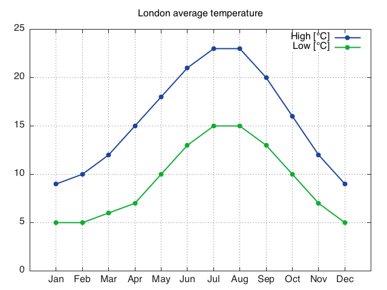
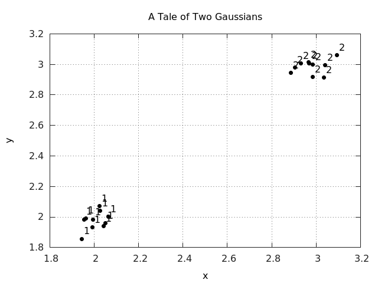

<a name="gnuplot.commons.dok"></a>
## Common Operations ##

It is possible to manage multiple plots at a time, printing plots to
png, eps or pdf files or creating plots directly on png or eps or pdf files.

There are also several handy operations for decorating plots which are
common to many of the plotting functions.

<a name="gnuplot.setgnuplotexe"></a>
### gnuplot.setgnuplotexe(exe) ###

Manually set the location of gnuplot executable.

<a name="gnuplot.setterm"></a>
### gnuplot.setterm(teerm) ###

Manually set the gnuplot terminal.

<a name="gnuplot.closeall"></a>
### gnuplot.closeall() ###

Close all gnuplot active connections. This will not be able to close
open windows, since on the backend gnuplot also can not close windows.

<a name="gnuplot.figure"></a>
### gnuplot.figure([n]) ###

Select (or create) a new figure with id `n`. Note that until a plot
command is given, the window will not be created. When `n` is
skipped, a new figure is created with the next consecutive id.

<a name="gnuplot.xlabel"></a>
### gnuplot.xlabel(label) ###

Sets the label of `x` axis to `label`. Only supported for gnuplot
version 4.4 and above.

<a name="gnuplot.ylabel"></a>
### gnuplot.ylabel(label) ###

Sets the label of `y` axis to `label`. Only supported for gnuplot
version 4.4 and above.

<a name="gnuplot.zlabel"></a>
### gnuplot.zlabel(label) ###

Sets the label of `z` axis to `label`. Only supported for gnuplot
version 4.4 and above.

<a name="gnuplot.title"></a>
### gnuplot.title(title) ###

Sets the title of the plot to `title`. Only supported for gnuplot
version 4.4 and above.

<a name="gnuplot.grid"></a>
### gnuplot.grid(toggle) ###

If `toggle` is `true` then a grid is displayed, else it is
hidden. Only supported for gnuplot version 4.4 and above.

<a name="gnuplot.movelegend"></a>
### gnuplot.movelegend(hloc,vloc) ###

Set the location of legend key. `hloc` can be `left`, `right` or
`center`. `vloc` can be `top`, `bottom` or `middle`. Only
supported for gnuplot version 4.4 and above.

<a name="gnuplot.axis"></a>
### gnuplot.axis(axis) ###

Sets the properties of axis for the current plot.

  * `auto` : auto scales the axis to fit data and plot canvas
  * `image` : scales the axis aspect ratio so that a circle is drawn as circle.
  * `equal` : same as `image`.
  * `fill` : resets the aspect ratio of the plot to original values so that it fills up the canvas as good as possible.
  * `{xmin,xmax,ymin,ymax}` : Sets the limits of x and y axes. Use an empty string (2 apostophes in a row) if you want to keep the current value.

<a name="gnuplot.raw"></a>
### gnuplot.raw(command) ###

This command is useful for advanced users of gnuplot. `command` is
directly passed to gnuplot without any formatting.

Let's see an example, by plotting labels for the `xtic`

```lua
LondonTemp = torch.Tensor{{9, 10, 12, 15, 18, 21, 23, 23, 20, 16, 12, 9},
                          {5,  5,  6,  7, 10, 13, 15, 15, 13, 10,  7, 5}}
gnuplot.plot({'High [°C]',LondonTemp[1]},{'Low [°C]',LondonTemp[2]})
gnuplot.raw('set xtics ("Jan" 1, "Feb" 2, "Mar" 3, "Apr" 4, "May" 5, "Jun" 6, "Jul" 7, "Aug" 8, "Sep" 9, "Oct" 10, "Nov" 11, "Dec" 12)')
gnuplot.plotflush()
gnuplot.axis{0,13,0,''}
gnuplot.grid(true)
gnuplot.title('London average temperature')
```
 

We can show another example of its usage by labeling data points. Here, we generate two clusters of data with two Gaussian distributions, write it to a text file in three columns of (label, x_coor, y_coor), and plot the points with labels. 

```lua 
labels_tab = {}
for i=1,20 do
  table.insert(labels_tab, math.ceil(i/10))
end
x = torch.cat(torch.Tensor(10):normal(2, 0.05), torch.Tensor(10):normal(3, 0.05), 1)
y = torch.cat(torch.Tensor(10):normal(2, 0.05), torch.Tensor(10):normal(3, 0.05), 1)

file = io.open('gaussians.txt', 'w')
io.output(file)
for i=1,20 do
  io.write(string.format('%d %f %f\n', labels_tab[i], x[i], y[i]))
end
io.close(file)

gnuplot.pngfigure('plot_labels.png')
gnuplot.title('A Tale of Two Gaussians')
gnuplot.raw("plot 'gaussians.txt' using 2:3:(sprintf('%d', $1)) with labels point pt 7 offset char 0.5,0.5 notitle")
gnuplot.xlabel('x')
gnuplot.ylabel('y')
gnuplot.grid(true)
gnuplot.plotflush()
```

