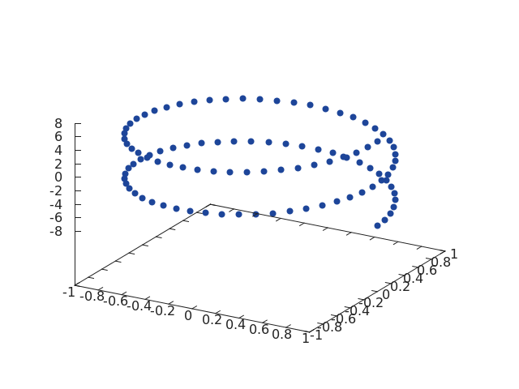
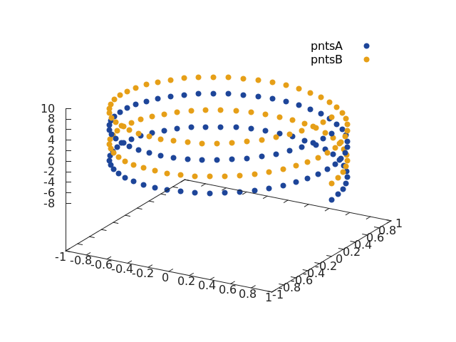

<a name="gnuplot.scatter3.dok"></a>
## Plotting 3D Points ##

Arbitrary 3D point constellations can be plotted using an API similar to the
`scatter3` function in Matalb.

<a name="gnuplot.scatter3"></a>
### gnuplot.scatter3(x, y, z) ###
Plot `(x_i, y_i, z_i)` triplets in 3D.

```lua
z = torch.linspace(-2 * math.pi, 2 * math.pi)
x = z:clone():cos()
y = z:clone():sin()
gnuplot.scatter3(x, y, z)
```


It is also possible to specify a header, as well as multiple scatter plot sets
on the same axis.

```lua
z1 = torch.linspace(-2 * math.pi, 2 * math.pi)
x = z1:clone():cos()
y = z1:clone():sin()
z2 = z1:clone():add(math.pi)
gnuplot.scatter3({'pntsA', x, y, z1}, {'pntsB', x, y, z2})
```


